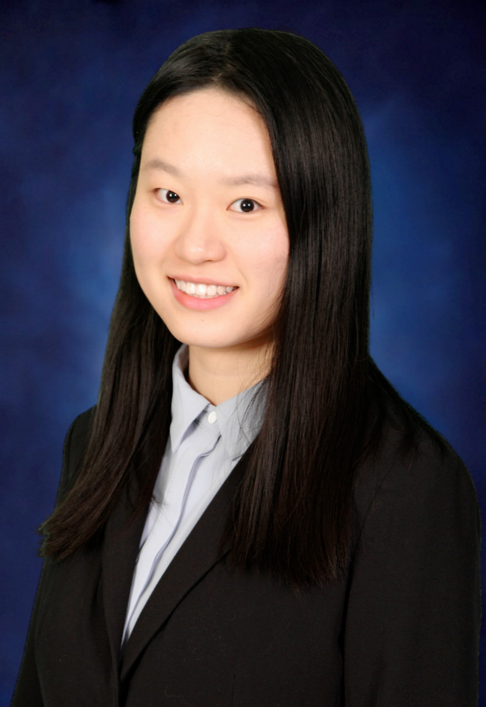

## Hello! I'm Linda

Welcome to my website! :relaxed:

I'm a sophomore student studying pursuing a dual degree in Accountancy and Statistics at the University of Illinois at Urbana-Champaign. On campus, I get involved in EntreCORPS, a business RSO focus on start-ups consulting. I did projects for clients ranging from education to technology companies. In the future, I'm planning to do public accounting after graduation and combine accounting with data analytics. 

